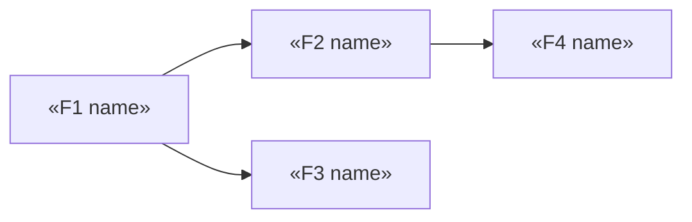

<!-- fill: Where the MVP line gets drawn and defended. The prioritization reasoning
     matters as much as the list — a reader must understand WHY the cut fell here.
     Nothing is silently dropped: everything below the line goes to 09-Roadmap.md.
     Remove every <!-- fill --> comment before delivery. -->

# Feature Specification — «Product Name»

## 1. Prioritization Method

<!-- fill: State the method and apply it consistently. Suggested scoring:
       Problem weight  — how highly ranked is the problem it serves (1-5)
       Reach           — proportion of the primary segment affected (1-5)
       Effort          — build cost, inverted (1 = large, 5 = small)
       Confidence      — evidence standing of the underlying problem (1-5)
     Score = (Problem × Reach × Confidence) / Effort-cost
     Any method is acceptable. Applying it inconsistently is not. -->

Method: «named method»

| Factor | Meaning | Scale |
| --- | --- | --- |
| Problem weight | Rank of the problem served | 1–5 |
| Reach | Share of primary segment affected | 1–5 |
| Confidence | Evidence standing of the problem | 1–5 |
| Effort | Build cost | S / M / L |

---

## 2. Feature Inventory

| # | Feature | Problem | Weight | Reach | Confidence | Effort | Score | Tier |
| --- | --- | --- | --- | --- | --- | --- | --- | --- |
| F1 | «feature» | P1 | 5 | 5 | 4 | M | «n» | MVP |
| F2 | «feature» | P1 | 4 | 4 | 4 | S | «n» | MVP |
| F3 | «feature» | P2 | 3 | 3 | 2 | L | «n» | Fast-follow |
| F4 | «feature» | P3 | 2 | 2 | 2 | L | «n» | Later |

---

## 3. The MVP Cut Line

<!-- fill: The most important paragraph in this document. Draw the line and defend it.
     A reader should understand what principle put F2 above the line and F3 below it.
     Do not cut on effort alone — cut on "what is the smallest thing that solves the
     sharpest problem for the primary persona end to end". -->

**The line falls after F«n».**

**Principle applied:** «one sentence — what makes something MVP»

**Reasoning:** «one paragraph. Why these features and not the next one down. What the
MVP proves that a smaller version would not.»

**What the MVP does NOT do:** «the notable absences, so nobody is surprised»

**The test:** Can the primary persona complete «job J«n»» end to end using only the
features above the line? «yes/no — if no, the cut is wrong»

---

## 4. MVP Features

### F«n» — «feature name»

| | |
| --- | --- |
| Tier | MVP |
| Serves | P«n» / J«n» |
| Requirement | R«n» |
| Effort | «S/M/L» |
| Depends on | «F«n» or none» |

**Behavior**

«What it does, from the user's point of view. Enough that a designer and an engineer
would build the same thing.»

**Acceptance criteria**
- [ ] «testable»
- [ ] «testable»

**Edge cases**

| Case | Expected behavior |
| --- | --- |
| «case» | «behavior» |

**Out of scope for this feature**

«What a reader might reasonably assume is included, but is not.»

---

<!-- fill: Repeat for each MVP feature. -->

---

## 5. Fast-Follow

<!-- fill: Not in MVP, but expected soon after. Enough detail to plan around,
     less than MVP features. -->

| # | Feature | Serves | Why not MVP | Target |
| --- | --- | --- | --- | --- |
| F«n» | «feature» | P«n» | «reason» | «milestone» |

---

## 6. Deferred

<!-- fill: Everything below the line that is not fast-follow. Carried to the roadmap.
     NOTHING is dropped silently — if it was considered, it appears here or above. -->

| # | Feature | Serves | Deferred because | Revisit when |
| --- | --- | --- | --- | --- |
| F«n» | «feature» | P«n» | «reason» | «trigger» |

---

## 7. Rejected

<!-- fill: Features considered and deliberately rejected, with reasons.
     This section stops the same idea being re-proposed every quarter. -->

| Feature | Rejected because |
| --- | --- |
| «feature» | «reason» |

---

## 8. Dependency Order

<!-- fill: What must be built before what. Feeds the roadmap and the build handoff. -->

**Critical path:** «F1 → F2 → F4»

---

<!-- ACCEPTANCE — remove before delivery
- [ ] Prioritization method stated and applied consistently across all features
- [ ] MVP cut line drawn with the reasoning recorded
- [ ] The end-to-end test passes: primary persona can complete the core job with MVP only
- [ ] Each feature has behavior, acceptance criteria and dependencies
- [ ] Post-MVP scope carried to Deferred or Fast-follow — nothing dropped silently
- [ ] Rejected features recorded with reasons
- [ ] Dependency graph present
- [ ] Every fill comment removed
-->
