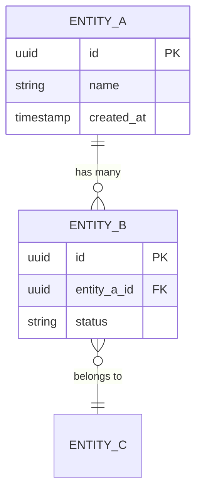
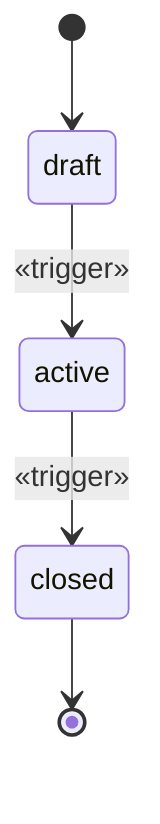

<!-- fill: This must be complete enough that an engineer or coding agent can generate a
     schema WITHOUT asking a follow-up question. That is the bar. If a type, nullability,
     or relationship cardinality is missing, the document is not done.
     Compliance requirements from the dossier (retention, PII, audit) belong here, in the
     model — not as a note at the end.
     Remove every <!-- fill --> comment before delivery. -->

# Data Model — «Product Name»

## 1. Overview

«One paragraph: the shape of the data and the central entity everything hangs off.»

**Database:** «engine and version»
**Conventions:** «naming, primary keys, timestamps, soft deletes»

---

## 2. Entity Relationship Diagram

---

## 3. Entities

<!-- fill: One block per entity. Every column needs: name, type, nullability,
     default, and a description if the name is not self-evident.
     Do not skip constraints — they encode business rules that would otherwise be lost. -->

### «EntityName»

«One sentence: what this represents in the real world.»

| Column | Type | Null | Default | Description |
| --- | --- | --- | --- | --- |
| `id` | uuid | no | gen_random_uuid() | Primary key |
| `«column»` | «type» | «yes/no» | «default» | «meaning» |
| `created_at` | timestamptz | no | now() | |
| `updated_at` | timestamptz | no | now() | |

**Constraints**
- `PRIMARY KEY (id)`
- `UNIQUE («column»)` — «business rule this enforces»
- `FOREIGN KEY («column») REFERENCES «table»(id) ON DELETE «action»`
- `CHECK («condition»)` — «business rule this enforces»

**Indexes**

| Index | Columns | Reason |
| --- | --- | --- |
| `idx_«name»` | «columns» | «which query this serves» |

**Relationships**

| Related entity | Cardinality | Via | On delete |
| --- | --- | --- | --- |
| «entity» | 1:N | `«fk»` | «cascade/restrict/null» |

**Classification**

| | |
| --- | --- |
| Contains PII | «yes/no — which columns» |
| Contains regulated data | «yes/no — which regime» |
| Retention | «period and basis» |
| Audit required | «yes/no» |

---

<!-- fill: Repeat for each entity. -->

---

## 4. Enumerations

| Enum | Values | Used by |
| --- | --- | --- |
| `«name»` | `«a»`, `«b»`, `«c»` | «entity.column» |

---

## 5. State Machines

<!-- fill: Where an entity has a lifecycle, specify the legal transitions.
     Ambiguity here becomes bugs later. Include what is FORBIDDEN, not just what is allowed. -->

### «Entity» status

| From | To | Trigger | Guard |
| --- | --- | --- | --- |
| draft | active | «action» | «condition that must hold» |

**Forbidden transitions:** «what must never happen, and why»

---

## 6. Data Integrity Rules

<!-- fill: Business rules the database enforces, beyond simple types.
     These prevent invalid states that application code alone would eventually allow. -->

| # | Rule | Enforced by |
| --- | --- | --- |
| 1 | «rule» | «constraint / trigger / application» |

---

## 7. Compliance and Privacy

<!-- fill: Drawn from the regulatory landscape in the dossier. This is design, not
     documentation — retention, encryption and audit are structural decisions. -->

| Requirement | Regime | Implementation |
| --- | --- | --- |
| «e.g. audit trail on record access» | «regime» | «how the model satisfies it» |
| «e.g. encryption at rest for PII» | «regime» | «which columns, which method» |
| «e.g. right to erasure» | «regime» | «soft delete + purge policy» |

**PII inventory**

| Entity.column | Data type | Encrypted | Retention | Erasure method |
| --- | --- | --- | --- | --- |
| «table.column» | «e.g. name» | «yes/no» | «period» | «how» |

---

## 8. Seed and Reference Data

| Table | Rows required at launch | Source |
| --- | --- | --- |
| «table» | «what must exist» | «where it comes from» |

---

## 9. Migration Notes

<!-- fill: Only if replacing or integrating with an existing system.
     From 03-user's "tools being replaced" — the migration path is often the
     hardest part of adoption and the most commonly underestimated. -->

| From | To | Volume | Approach | Risk |
| --- | --- | --- | --- | --- |
| «source system» | «entity» | «estimate» | «method» | «what could go wrong» |

---

## 10. Open Questions

| # | Question | Blocks | Owner |
| --- | --- | --- | --- |
| Q1 | «question» | «which entity or decision» | «who» |

---

<!-- ACCEPTANCE — remove before delivery
- [ ] Every entity has columns with types, nullability and defaults
- [ ] Every relationship states cardinality and on-delete behaviour
- [ ] Constraints and indexes present with the reason for each
- [ ] ERD included and matches the entity definitions
- [ ] State machines specified where entities have a lifecycle
- [ ] Compliance requirements from the dossier reflected structurally
- [ ] PII inventory complete
- [ ] A schema could be generated from this without asking a question
- [ ] Every fill comment removed
-->
