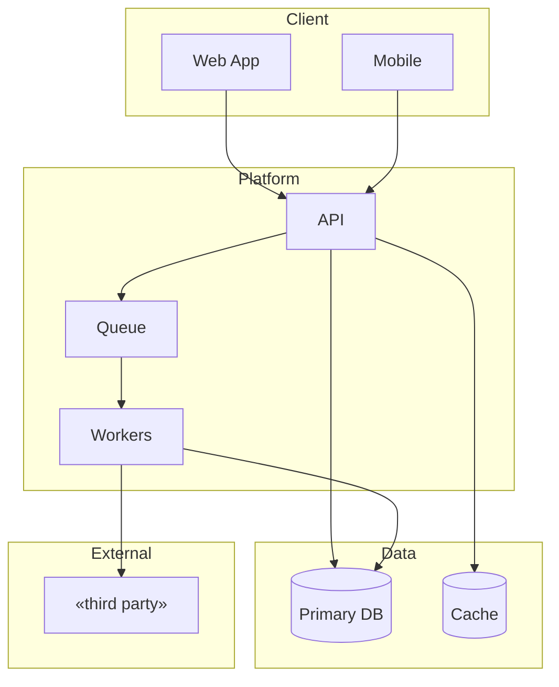

<!-- fill: Stack choices must be JUSTIFIED with trade-offs stated, not asserted.
     "We will use Postgres" is an assertion. "Postgres, because the data is relational,
     the compliance regime requires row-level audit, and the team knows it — at the cost
     of harder horizontal scaling later" is a justification.
     Remove every <!-- fill --> comment before delivery. -->

# Architecture — «Product Name»

## 1. Summary

«One paragraph: the shape of the system in plain language. Someone should be able to
picture it before seeing a diagram.»

---

## 2. System Diagram

---

## 3. Components

| Component | Responsibility | Technology | Why |
| --- | --- | --- | --- |
| «name» | «what it owns» | «tech» | «reason» |

**Boundaries:** «what each component must never do — the rules that keep the system from
degenerating into a ball of mud»

---

## 4. Technology Choices

<!-- fill: One block per significant choice. The trade-off line is mandatory.
     A choice with no stated cost has not been thought about. -->

### «Layer — e.g. Database»

| | |
| --- | --- |
| Chosen | «technology» |
| Alternatives considered | «a», «b» |
| Reason | «why this one» |
| Trade-off accepted | «what we give up by choosing it» |
| Reversible? | «yes/no — and what it would cost to change later» |

---

<!-- fill: Repeat for: runtime/language, framework, database, cache, queue, hosting,
     auth provider, and any significant third-party dependency. -->

---

## 5. Integrations

| System | Purpose | Protocol | Auth | Failure mode | Fallback |
| --- | --- | --- | --- | --- | --- |
| «name» | «why» | «REST/webhook» | «scheme» | «what breaks» | «what we do» |

**Vendor risk:** «what happens if a critical integration disappears or changes terms»

---

## 6. Security Model

<!-- fill: Drawn from the regulatory landscape in the dossier. Compliance obligations
     identified during research must be visible here as concrete controls. -->

| Concern | Control | Regime driving it |
| --- | --- | --- |
| Authentication | «mechanism» | — |
| Authorisation | «mechanism, enforcement point» | — |
| Data in transit | «TLS version, cert management» | «regime» |
| Data at rest | «encryption, key management» | «regime» |
| Secrets | «where stored, how rotated» | — |
| Audit logging | «what is logged, retention, immutability» | «regime» |
| Backups | «frequency, retention, restore tested?» | «regime» |

### Threat Considerations

| Threat | Vector | Mitigation |
| --- | --- | --- |
| «e.g. record access by another tenant» | «IDOR on resource id» | «scoped queries + tests» |
| «e.g. credential stuffing» | «login endpoint» | «rate limit + lockout» |

---

## 7. Scalability

<!-- fill: From launch scale to a STATED target. "It should scale" is not a plan.
     Name the number, name the bottleneck you expect first, and name what you would
     do about it. Do not architect for scale you have no evidence of needing. -->

| | Launch | Target | Basis |
| --- | --- | --- | --- |
| Users | «n» | «n» | «from the market sizing» |
| Requests/sec | «n» | «n» | «derived» |
| Data volume | «n» | «n» | «derived» |

**First expected bottleneck:** «what, and at roughly what load»

**Response when reached:** «the specific action — not "scale horizontally"»

**Deliberately NOT built for:** «the scale we are not designing for, and why that is correct»

---

## 8. Reliability

| Concern | Approach |
| --- | --- |
| Availability target | «figure, and whether it is justified» |
| Failure isolation | «how a failing component is contained» |
| Data durability | «replication, backup, RPO/RTO» |
| Degraded operation | «what still works when «X» is down» |

---

## 9. Environments

| Environment | Purpose | Data | Access |
| --- | --- | --- | --- |
| Local | Development | Seeded | Developers |
| Staging | Pre-release verification | Anonymised | Team |
| Production | Live | Real | Restricted |

---

## 10. Observability

| Signal | Tool | What it answers |
| --- | --- | --- |
| Logs | «tool» | «what happened» |
| Metrics | «tool» | «is it healthy» |
| Traces | «tool» | «where is the latency» |
| Alerts | «tool» | «what needs a human now» |

<!-- fill: Instrumentation for product metrics is specified in 11-Success-Metrics.md.
     This section covers system health only. -->

---

## 11. Cost Model

| Component | Launch cost/mo | At target scale | Driver |
| --- | --- | --- | --- |
| «hosting» | «figure» [tag] | «figure» [tag] | «what makes it grow» |

**Total at launch:** «figure» [tag]

---

## 12. Architecture Decisions

<!-- fill: The decisions worth remembering, with the alternatives rejected.
     This is what makes the architecture auditable a year from now. -->

| # | Decision | Alternatives rejected | Rationale | Reversible |
| --- | --- | --- | --- | --- |
| AD1 | «decision» | «a», «b» | «why» | yes/no |

---

<!-- ACCEPTANCE — remove before delivery
- [ ] System diagram present with boundaries and integrations
- [ ] Every stack choice states its trade-off and reversibility
- [ ] Regulatory requirements from the dossier appear as concrete controls
- [ ] Threat considerations specific to this product, not generic
- [ ] Scalability path from launch to a stated target, with the first bottleneck named
- [ ] What we are deliberately NOT building for is stated
- [ ] Cost model present
- [ ] Every fill comment removed
-->
