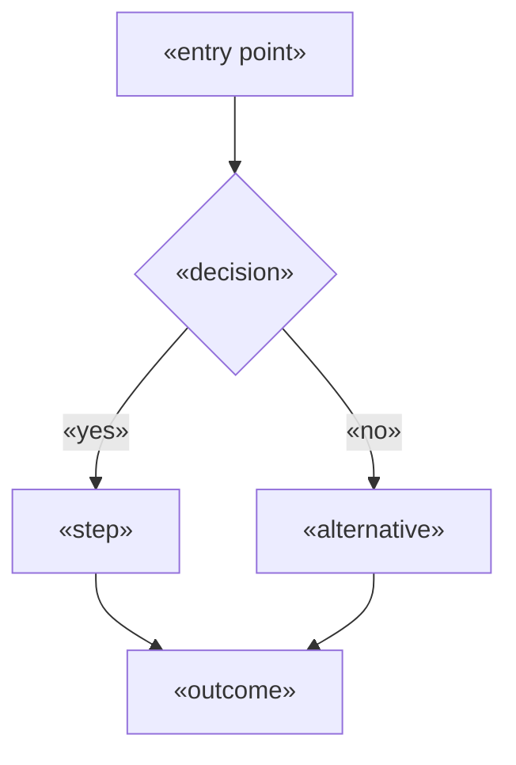

<!-- fill: The critical paths, end to end. Empty, error and edge states are NOT optional —
     they are where products are actually lost. Time to first value must be stated in
     minutes, because it is the number that predicts adoption.
     Remove every <!-- fill --> comment before delivery. -->

# UX Flows — «Product Name»

## 1. Design Principles

<!-- fill: Three to five, derived from the research — not generic UX platitudes.
     If the research found that the user is interrupted constantly, a principle might be
     "every action must survive being abandoned halfway". That is useful. "Keep it simple"
     is not. -->

| # | Principle | Derived from |
| --- | --- | --- |
| 1 | «principle» | «research finding» |
| 2 | «principle» | «research finding» |

---

## 2. Time to First Value

<!-- fill: The single most predictive adoption number. From first landing to the moment
     the user gets something they actually wanted. Count the steps. State the minutes. -->

| | |
| --- | --- |
| Definition of "first value" | «the specific moment» |
| Steps required | «n» |
| Target time | «n minutes» |
| Longest unavoidable step | «what, and why it cannot be removed» |

---

## 3. Critical Paths

<!-- fill: The two or three flows that matter. For each: the trigger, every step,
     what the user sees, and what could go wrong at each step. -->

### CP1 — «flow name» (serves J«n»)

**Trigger:** «what starts this»
**Persona:** «who»
**Frequency:** «how often they do this»
**Success:** «what "done" means to them»

| Step | User sees | User does | System does | Can fail? |
| --- | --- | --- | --- | --- |
| 1 | «screen/state» | «action» | «response» | «how» |
| 2 | | | | |

**Step count:** «n»
**Target completion time:** «duration»

**Failure and recovery**

| Failure | User sees | Recovery path | Data preserved? |
| --- | --- | --- | --- |
| «what goes wrong» | «message» | «what they do» | «yes/no» |

---

<!-- fill: Repeat for each critical path. Keep it to the flows that carry the product. -->

---

## 4. Screen and State Inventory

<!-- fill: Every screen needs its non-happy states specified. A screen defined only in
     its populated state will ship broken — empty and error states are where the work is. -->

| Screen | Purpose | Empty state | Loading state | Error state |
| --- | --- | --- | --- | --- |
| «name» | «why it exists» | «what shows, what action is offered» | «skeleton/spinner» | «message + recovery» |

---

## 5. Onboarding

<!-- fill: How a brand new user gets from nothing to first value.
     Reference the switching cost from the dossier — if migration is required,
     it belongs in this flow, not after it. -->

| Step | Purpose | Skippable | Drop-off risk |
| --- | --- | --- | --- |
| 1 | «what» | «yes/no» | «high/med/low» |

**Data migration required?** «yes/no — if yes, where it sits in the flow»

**First-run empty state:** «what the user sees before they have any data, and how they
are guided out of it»

---

## 6. Edge Cases

<!-- fill: The situations that break naive implementations. Draw from the persona's
     real context — interruptions, poor connectivity, shared devices, concurrent users. -->

| Case | Expected behavior |
| --- | --- |
| Interrupted mid-flow | «what is preserved and how they resume» |
| Offline or poor connection | «behavior» |
| Concurrent edit by another user | «resolution» |
| Very large data volume | «behavior» |
| First use with no data | «behavior» |

---

## 7. Accessibility

| Requirement | Standard | Applied where |
| --- | --- | --- |
| Keyboard navigation | WCAG 2.1 AA | All interactive elements |
| Contrast | WCAG 2.1 AA | «tokens» |
| Screen reader | «approach» | «which flows verified» |
| Target size | «minimum» | «touch targets» |

<!-- fill: If the persona works in a specific physical context — gloves, bright light,
     one-handed, time pressure — those constraints belong here as concrete requirements. -->

**Context-specific requirements:** «from the persona's real working conditions»

---

## 8. Content and Tone

| Context | Approach | Example |
| --- | --- | --- |
| Error messages | «principle» | «example» |
| Empty states | «principle» | «example» |
| Confirmations | «principle» | «example» |

---

<!-- ACCEPTANCE — remove before delivery
- [ ] Critical paths mapped end to end with step counts
- [ ] The primary job completable in a stated number of steps
- [ ] Empty, loading and error states specified for every screen
- [ ] Time to first value stated in minutes
- [ ] Failure and recovery paths defined per critical path
- [ ] Edge cases drawn from the persona's real context, not generic
- [ ] Design principles derived from research, not platitudes
- [ ] Every fill comment removed
-->
