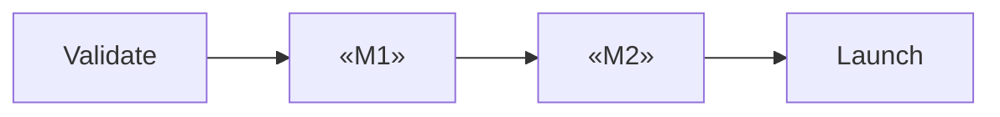

<!-- fill: Milestones must be INDEPENDENTLY SHIPPABLE — each one delivers value on its own,
     not just progress toward a distant release. If milestone 2 is useless without
     milestone 3, they are one milestone.
     Estimates carry evidence tags like any other claim. An unsourced timeline is an
     assumption, and should say so.
     Remove every <!-- fill --> comment before delivery. -->

# Roadmap — «Product Name»

## 1. Sequencing Principle

<!-- fill: State what governs the order. Common principles: de-risk earliest,
     value earliest, dependency order, learn earliest. Pick one and be consistent —
     they conflict, and a roadmap that silently switches between them is incoherent. -->

**Principle:** «one sentence»

**Why this and not «alternative»:** «one sentence»

---

## 2. Overview

```mermaid
gantt
    dateFormat YYYY-MM-DD
    title «Product Name» Roadmap
    section Validate
    «assumption test»      :a1, «start», «n»d
    section MVP
    «M1 name»              :m1, after a1, «n»d
    «M2 name»              :m2, after m1, «n»d
    section Post-MVP
    «M3 name»              :m3, after m2, «n»d
```

| Milestone | Delivers | Effort | Depends on |
| --- | --- | --- | --- |
| M0 | «validation» | «n days» [tag] | — |
| M1 | «capability» | «n weeks» [tag] | M0 |
| M2 | «capability» | «n weeks» [tag] | M1 |

---

## 3. Milestone Zero — Validate Before Building

<!-- fill: This milestone is mandatory when the sharpest problem is ASSUMED rather than
     validated. Building before this completes is the expensive mistake the framework
     exists to prevent. If the problem is already validated, state that and skip. -->

**Purpose:** «what belief this tests»

| Test | Method | Sample | Effort | Would invalidate |
| --- | --- | --- | --- | --- |
| «assumption» | «method» | «n and who» | «days» | «what stops if false» |

**Proceed if:** «the specific result that justifies building»
**Stop and rethink if:** «the specific result that does not»

---

## 4. Milestones

### M«n» — «name»

| | |
| --- | --- |
| Goal | «what this milestone achieves for a user» |
| Features | F«n», F«n» |
| Effort | «estimate» [tag] |
| Depends on | «M«n» or none» |
| Shippable alone? | «yes — what a user can do at the end of it» |

**Definition of done**
- [ ] «condition»
- [ ] «condition»
- [ ] «condition»

**What a user can do at the end of this milestone that they could not before:**
«one sentence — if this is hard to answer, the milestone is not independently shippable»

**Risks specific to this milestone**

| Risk | Mitigation |
| --- | --- |
| «risk» | «approach» |

---

<!-- fill: Repeat per milestone. Keep the MVP to as few milestones as honestly possible. -->

---

## 5. Deferred Scope

<!-- fill: Carried from the feature spec. Everything below the MVP line lands here
     with a revisit trigger — not a date. Dates on unvalidated scope are fiction. -->

| Feature | Serves | Revisit when |
| --- | --- | --- |
| F«n» | P«n» | «trigger — e.g. "after 50 active clinics" » |

---

## 6. Critical Path



**Longest chain:** «M0 → M1 → M2 → Launch»
**Total to launch:** «duration» [tag]

**What could compress it:** «the parallelisable work, and what it would cost»

---

## 7. Estimate Basis

<!-- fill: Be honest about where these numbers come from. An estimate with no basis
     is an assumption and must be tagged as one. -->

| Milestone | Estimate | Basis | Confidence |
| --- | --- | --- | --- |
| M1 | «n weeks» | «comparable work / team velocity / assumption» | «high/med/low» |

**Assumed team:** «size and composition — estimates are meaningless without this»

**Biggest estimation risk:** «what is most likely to take longer than stated, and why»

---

## 8. Decision Points

<!-- fill: Moments where the plan should be re-evaluated against real data,
     rather than executed on faith. -->

| After | Question to answer | Data needed | Possible outcomes |
| --- | --- | --- | --- |
| M0 | «is the problem real?» | «test results» | proceed / pivot / stop |
| M1 | «do users complete the core job?» | «activation rate» | continue / rework |

---

<!-- ACCEPTANCE — remove before delivery
- [ ] Sequencing principle stated and applied consistently
- [ ] Milestone Zero present when the core problem is assumed rather than validated
- [ ] Each milestone independently shippable, with the user-facing gain stated
- [ ] Definition of done per milestone
- [ ] Deferred scope carried forward with revisit triggers, not dates
- [ ] Estimates carry a basis and an evidence tag
- [ ] Assumed team size stated
- [ ] Decision points defined with the data that answers them
- [ ] Every fill comment removed
-->
