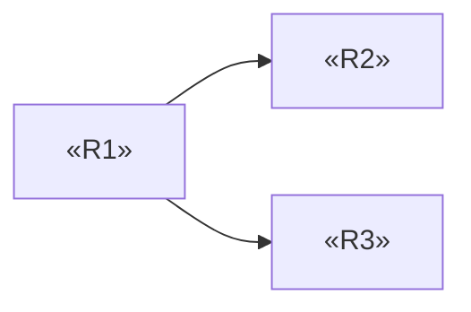

# Template — Product Specification

---

# Usage

Copy everything below the line into `projects/<slug>/research/08-product.md` and fill it.

This is a **working document**. It is the direct source for two shipped deliverables:

| Deliverable | Fed by |
| --- | --- |
| `03-PRD.md` | §2–§6, §9, §11, §12 |
| `04-Feature-Spec.md` | §7, §8, §10 |

| Marker | Meaning |
| --- | --- |
| `«placeholder»` | Replace with real content |
| `<!-- guidance -->` | Instructions for you. Remove before completing |
| `[tag]` | Evidence tag per `engine/evidence-policy.md` |

**The MVP cut from module 07 is binding.** Nothing below that line may appear as a MUST in
this document. If specifying reveals that the cut is wrong, that is a **regress to
07-strategy**, not a quiet addition here.

---
---

# Product Specification — «Project Name»

| | |
| --- | --- |
| Module | 08-product |
| Date | «ISO date» |
| Chosen approach | «from 07-strategy» |
| MVP line | «what sits above it, in one clause» |
| Problem evidence standing | **verified / assumed** — carried from 04-problem |
| Status | draft / reviewed / gated |

---

## 1. What This Product Does

<!-- Write last. Three sentences maximum. What it does, for whom, and the one job it
     completes. A reader who stops here should know what is being built. -->

«Three sentences.»

---

## 2. Inherited Scope

<!-- Restated so this document stands alone. Do not re-argue any of it — these are
     settled inputs. If one looks wrong, that is a regress, not an edit. -->

| | |
| --- | --- |
| Chosen approach | «from 07-strategy» |
| Primary persona | «name» — from 03-user |
| Core job | J«n» — «statement» — from 03-user |
| Sharpest problem | P«n» — «statement» — from 04-problem |
| Problem evidence standing | «verified / assumed» |
| Above the MVP line | «capability», «capability», «capability» |
| Below the line | «capability», «capability» |
| Non-goals | «from 07-strategy» |

**If the sharpest problem is assumed rather than verified:** «state it here plainly. The
requirements that serve it inherit that standing and are marked accordingly in §7. This
does not become certain because it is now written as a requirement.»

---

## 3. The Problem This Solves

<!-- From 04-problem, carried forward with its evidence tags intact. Do not restate
     more confidently than the source. -->

| Rank | Problem | Frequency | Severity | Evidence |
| --- | --- | --- | --- | --- |
| P1 | «statement» | «n» | «n» | `[verified: source]` |
| P2 | «statement» | «n» | «n» | `[inferred: basis]` |
| P3 | «statement» | «n» | «n» | `[assumption: needs validation]` |

**Which of these the MVP addresses:** «P«n», P«n»»

**Which it does not, and why:** «P«n» — «reason, and where it went in §10»»

---

## 4. Users

<!-- From 03-user. Only the segments this release actually serves. -->

### Primary — «persona name»

| | |
| --- | --- |
| Who | «role, context» |
| Core job | J«n» — «statement» |
| Current workaround | «what they do today» — from 04-problem |
| Success for them | «what changes in their day» |
| Constraints on them | «time, environment, skill, device, supervision» |

### Secondary — «persona name», if any

«same structure, plus: what this release does NOT do for them»

**Personas explicitly not served in this release:** «name — from 07-strategy non-goals»

---

## 5. The Core Job, Step by Step

<!-- The workflow from 03-user, numbered. This is the spine of the specification: every
     step must be either served by an MVP requirement, or explicitly left to the
     workaround. A step with neither is a hole in the product. -->

| # | Step the user takes | Served by | Or left to |
| --- | --- | --- | --- |
| 1 | «step» | R«n» | — |
| 2 | «step» | R«n» | — |
| 3 | «step» | — | «existing tool / manual» |

**End-to-end verdict:** «Can the primary persona complete J«n» using only the MVP
requirements plus the stated fallbacks? yes / no»

> If no, stop. This is module 07's end-to-end test failing under specification. Regress.

---

## 6. Goals and Non-Goals

### Goals of this release

<!-- What the release is FOR. Each must be observable. Not "delight users". -->

| # | Goal | How we would know | Metric owner |
| --- | --- | --- | --- |
| G1 | «goal» | «observable outcome» | 12-metrics |

### Non-goals

<!-- Carried from 07-strategy, plus anything this module deliberately excluded.
     A non-goal is something a reasonable reader would EXPECT to be included. -->

| Not doing | Why | Reconsider when |
| --- | --- | --- |
| «capability» | «reason» | «trigger / permanent» |
| «segment» | «reason» | «trigger / permanent» |
| «problem P«n»» | «reason» | «trigger / permanent» |

---

## 7. Requirements

<!-- The heart of the document. Rules, all enforced by the gate:

     1. Every requirement names a parent problem. No parent, no requirement.
     2. MUST is reserved for capabilities ABOVE module 07's MVP line. Nothing else.
     3. Priority language is exact:
          MUST   — the release does not ship without it
          SHOULD — ships without it, but the release is weaker
          COULD  — genuine optional
     4. Behavior is written so two independent engineers would build the same thing.
     5. Evidence column: `derived` (traces to a module finding) or `design decision`
        (a judgment made here — and if load-bearing, registered in §12).
-->

### R1 — «requirement name»

| | |
| --- | --- |
| Priority | MUST |
| Serves | P«n» / J«n» / step «n» |
| Basis | `derived: 04-problem P«n»` |
| Persona | «primary / both» |
| Depends on | «R«n» or none» |

**Behavior**

«What the system does, from the user's point of view. Inputs, what happens, what the user
sees afterwards. Precise enough that two engineers reading only this would build the same
thing.»

**Acceptance criteria**

<!-- Each must be falsifiable by observation. Banned words: fast, intuitive, easy,
     seamless, robust, user-friendly, performant. Replace each with an observable:
     a figure, a state, a countable event. -->

- [ ] «Given «state», when «action», then «observable result»»
- [ ] «Given «state», when «action», then «observable result»»

**Not included in this requirement**

«What a reader might reasonably assume is covered, and is not.»

---

### R2 — «requirement name»

«same structure»

---

<!-- Repeat for every requirement. -->

### Derived figures

<!-- Every number the interface shows that is NOT a single stored field: totals, counts,
     percentages, balances, and any status computed from several records.

     Name the population. The label is not the definition — "the monthly total" is a
     heading, and two engineers will implement it two ways.

     The rows that matter most are the ones your own spec made possible: if anything in
     §7 can reverse, cancel, supersede or archive a record, every figure downstream of it
     needs a stated position on that record. The requirement that introduces a reversal
     almost never says so, because it is written from the point of view of the person
     doing the reversing. -->

| Figure | Where shown | Includes | Excludes | Period rule |
| --- | --- | --- | --- | --- |
| «name» | «screen / R«n»» | «records counted, and in what state» | «records deliberately left out» | «which period a record spanning two lands in» |

**Reversal position:** «for each reversible action in §7 — a void, cancellation, refund,
correction or archive — state which figures it removes a record from, and which it does
not. "Nothing in this spec is reversible" is a complete answer and is worth writing.»

---

## 8. Failure and Edge States

<!-- A feature specified only for the happy path is not specified. For each MVP
     requirement, work these five categories. "Not applicable" is an acceptable
     answer; a blank row is not. -->

### R«n» — «requirement name»

| Category | Case | Expected behavior |
| --- | --- | --- |
| Empty | «no data yet / first use» | «behavior» |
| Invalid | «bad or incomplete input» | «behavior, and what the user is told» |
| Failure | «the operation cannot complete» | «behavior, and whether work is lost» |
| Permission | «user lacks the right» | «behavior» |
| Limit / conflict | «too much, too many, two at once, offline» | «behavior» |

**Data loss position:** «what, if anything, can be lost, and under what circumstances»

<!-- Repeat per requirement. Where a category is genuinely not applicable, write
     "not applicable — «reason»". -->

---

## 9. Constraints

<!-- Real limits the build must respect. Each traces to a source module. -->

| Constraint | Source | Consequence for the build |
| --- | --- | --- |
| «regulatory» | 02-market | «what it forbids or requires» |
| «cost to serve ceiling» | 06-business | «what it rules out» |
| «user environment» | 03-user | «device, connectivity, interruption» |
| «operating context» | 13-operations | «support, hours, language» |

---

## 10. Deferral Ledger

<!-- Nothing considered is dropped silently. Every capability that came up — in
     07-strategy, in this module, or in the source research — lands in exactly one row
     here or in §7. This section is what stops the same idea being re-proposed
     every month with no memory of why it was excluded. -->

| Capability | Serves | Tier | Excluded because | Revisit when |
| --- | --- | --- | --- | --- |
| «capability» | P«n» | Fast-follow | «reason» | «trigger» |
| «capability» | P«n» | Deferred | «reason» | «trigger» |
| «capability» | P«n» | Rejected | «reason» | permanent |

**Surfaced during specification:** «capabilities that only became visible while writing
requirements. State whether each was load-bearing for the core job. If any was, this
module regressed to 07-strategy — record that here.»

**Handed to 09-Roadmap:** «confirm that every Fast-follow and Deferred row appears in the
roadmap deliverable»

---

## 11. Prioritization and Dependency Order

<!-- The reasoning behind the ordering, and the build sequence. -->

**Method:** «named method — the same one used for every row»

| # | Requirement | Problem weight | Reach | Confidence | Effort | Score | Tier |
| --- | --- | --- | --- | --- | --- | --- | --- |
| R1 | «name» | «n» | «n» | «n» | «S/M/L» | «n» | MUST |

**Where the score and the tier disagree:** «name each case and say why. A high score below
the line, or a low score above it, is legitimate — but it needs a reason.»

**Build order**

**Critical path:** «R1 → R2 → R«n»»

**First shippable slice:** «the smallest subset that a user could actually use»

---

## 12. Design Decisions and Open Questions

<!-- Judgments made in this module that were not derived from research. These are
     assumptions and must be registered as such — U5. -->

| # | Decision made here | Alternative | Why this one | Load-bearing |
| --- | --- | --- | --- | --- |
| D1 | «decision» | «alternative» | «reason» | yes / no |

**Open questions**

| # | Question | Blocks | Who answers |
| --- | --- | --- | --- |
| Q1 | «question» | R«n» | operator / 09-technology / user research |

<!-- A question marked NEEDS USER cannot be answered by inference. Carry it to
     state.open_questions and say so in the deliverables. -->

---

## 13. Traceability

<!-- The gate reads this section directly. Two directions, both required. -->

**Requirements to problems** — every requirement has a parent:

| Requirement | Problem | Job | Persona |
| --- | --- | --- | --- |
| R1 | P1 | J1 | primary |

**Problems to requirements** — every problem above the line is served:

| Problem | Served by | If unserved, why |
| --- | --- | --- |
| P1 | R1, R3 | — |
| P2 | — | «deferred — §10 row «n»» |

**Orphans:** «none / list them — a requirement with no parent problem is deleted, not
justified»

---

## 14. Contradicting Evidence

<!-- Required and non-empty. What in the research argues against this specification as
     written? An empty section fails the review loop. -->

- «finding that argues against a requirement, and what it would change»

---

## 15. Confidence

| | |
| --- | --- |
| Confidence in this specification | high / medium / low |
| Basis | «share of requirements derived from verified findings» |
| Weakest requirement | R«n» — «why» |
| What would raise it | «specific evidence» |

<!-- Confidence here cannot exceed the confidence of the problems these requirements
     serve. A precise requirement built on an assumed problem is precisely specified
     and still uncertain. -->

---

## 16. Handoff

| Consumer | What it takes from here |
| --- | --- |
| `09-technology` | Requirements, edge states, constraints, data implied by §7 |
| `10-execution` | Build order, critical path, first shippable slice |
| `12-metrics` | Goals in §6 and their observable outcomes |
| `03-PRD.md` | §2–§6, §9, §11, §12 |
| `04-Feature-Spec.md` | §7, §8, §10 |

---

<!-- ACCEPTANCE — remove before completing
- [ ] Every requirement names a parent problem
- [ ] Every problem above the line is served, or its deferral is recorded in §10
- [ ] No MUST requirement sits below module 07's MVP line
- [ ] Every acceptance criterion is falsifiable by observation
- [ ] No banned aspirational word appears in an acceptance criterion
- [ ] Every MVP requirement has all five edge categories worked
- [ ] §5 end-to-end verdict is yes
- [ ] §10 accounts for everything considered — nothing dropped silently
- [ ] Design decisions registered as assumptions
- [ ] §14 non-empty
- [ ] Confidence does not exceed the confidence of the underlying problems
- [ ] Every «placeholder» replaced and every guidance comment removed
-->

---

> **Template Principle**
>
> This document is read by someone who will build from it and cannot ask you anything.
>
> Every sentence they would have to guess at is a defect.
