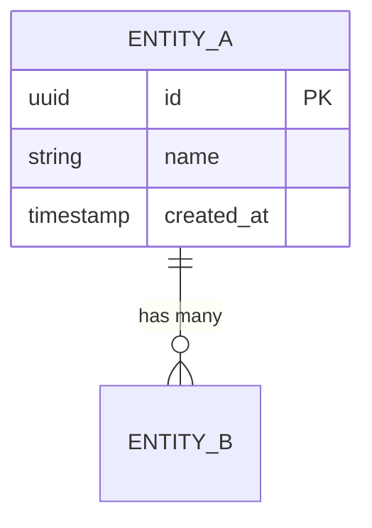
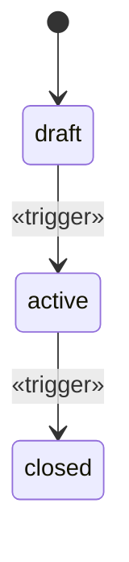
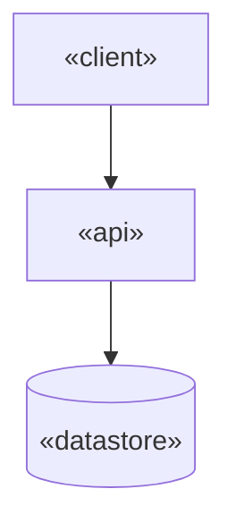

# Template — Technical Design

---

# Usage

Copy everything below the line into `projects/<slug>/research/09-technology.md` and fill it.

This is a **working document**. It is the direct source for four shipped deliverables — more
than any other module:

| Deliverable | Fed by |
| --- | --- |
| `05-Data-Model.md` | §3, §4, §5 |
| `06-API-Contract.md` | §6, §7 |
| `07-Architecture.md` | §2, §8, §9, §10, §11, §12, §13 |
| `12-Build-Handoff.md` | §2, §3, §6, §14 |

| Marker | Meaning |
| --- | --- |
| `«placeholder»` | Replace with real content |
| `<!-- guidance -->` | Instructions for you. Remove before completing |
| `[tag]` | Evidence tag per `engine/evidence-policy.md` |

**The bar for this document** is that an engineer or a coding agent could build from it
without asking a follow-up question. Anywhere they would have to ask, the document is not
finished.

---
---

# Technical Design — «Project Name»

| | |
| --- | --- |
| Module | 09-technology |
| Date | «ISO date» |
| Requirements source | `08-product` §7, «n» MUST requirements |
| Regulatory regimes | «from 02-market, or none» |
| Cost ceiling | «cost to serve, from 06-business» |
| Status | draft / reviewed / gated |

---

## 1. The Design, in One Paragraph

<!-- Write last. The shape of the system, the central entity everything hangs off, and the
     one thing that would be hardest to change later. -->

«One paragraph.»

---

## 2. Inherited Inputs

<!-- Settled inputs. Nothing here is re-argued in this module. -->

| | |
| --- | --- |
| MUST requirements | «n», from `08-product` |
| First shippable slice | «from 08-product §11» |
| Regulatory regimes | «from 02-market» |
| Cost-to-serve ceiling | «figure per user or per unit, from 06-business» |
| Price point | «from 06-business» |
| Launch scale | «users, from 06-business» |
| Target scale | «users, and by when» |
| User environment | «device, connectivity, interruption — from 03-user» |

**Where these conflict:** «name any place a requirement cannot be met inside the cost
ceiling or the regulatory constraint. This is a regress signal, not a detail to absorb.»

---

## 3. Data Model

<!-- Move 2. The bar: schema-generatable without a follow-up question.
     Every entity must trace to a requirement. Every requirement's data must be here. -->

**Conventions:** «primary key type, naming, timestamps, soft delete, timezone handling»

**Central entity:** «what the model hangs off, and why»

### Entity Relationship Diagram



### «EntityName»

«One sentence: what this represents in the real world.»

| | |
| --- | --- |
| Derived from | R«n», R«n» |
| Lifecycle | «none / see §5» |

| Column | Type | Null | Default | Meaning |
| --- | --- | --- | --- | --- |
| `id` | uuid | no | generated | Primary key |
| `«column»` | «type» | «yes/no» | «default» | «meaning» |
| `created_at` | timestamptz | no | now() | |

**Constraints**

- `UNIQUE («column»)` — «the business rule this enforces»
- `FOREIGN KEY («column») REFERENCES «table»(id) ON DELETE «action»` — «why that action»
- `CHECK («condition»)` — «the business rule this enforces»

**Indexes**

| Index | Columns | Query it serves |
| --- | --- | --- |
| `idx_«name»` | «columns» | «the specific query, from a requirement» |

**Classification**

| | |
| --- | --- |
| Contains PII | «yes — which columns / no» |
| Regulated data | «regime, or none» |
| Retention | «period» + `[verified: source]` for the basis |
| Audit required | «yes/no» |
| Encryption at rest | «field-level / volume / none, and why» |

<!-- Repeat per entity. Every constraint encodes a business rule that is otherwise lost. -->

---

## 4. Enumerations

| Enum | Values | Used by | Source |
| --- | --- | --- | --- |
| `«name»` | `«a»`, `«b»` | «entity.column» | «requirement or standard» |

<!-- Where an enumeration comes from a domain coding system, cite it. Do not invent
     domain codes. -->

---

## 5. State Machines

<!-- For every entity with a lifecycle. State what is FORBIDDEN, not only what is allowed —
     the forbidden transitions are where the bugs live. -->

### «Entity» status



| From | To | Trigger | Who may | Side effects |
| --- | --- | --- | --- | --- |
| draft | active | «trigger» | «role» | «what else changes» |

**Forbidden transitions:** «list them explicitly, with what happens if attempted»

**What is editable in each state:** «per state — this is a requirement, not an
implementation detail»

---

## 6. Interface Contract

<!-- Move 3. Concrete shapes, not descriptions. Every MUST requirement must be reachable
     through this interface, and every operation must serve a requirement. -->

**Style:** «REST / GraphQL / RPC / library API» — «why, in one line»
**Base:** «/v1» — **Versioning:** «policy»

### `«METHOD» /«path»`

| | |
| --- | --- |
| Serves | R«n» |
| Auth | «required role / scope» |
| Idempotent | «yes/no — and if no, why that is safe» |

**Request**

```json
{ "«field»": "«type»" }
```

| Field | Type | Required | Validation | From requirement |
| --- | --- | --- | --- | --- |
| `«field»` | «type» | yes | «rule» | R«n» |

**Response — success**

```json
{ "«field»": "«type»" }
```

**Failure responses**

| Status | Code | When | Maps to edge case |
| --- | --- | --- | --- |
| 409 | `conflict` | «condition» | `08-product` §8 «case» |

<!-- Repeat per operation. -->

### Error Taxonomy

| Status | Code | Meaning |
| --- | --- | --- |
| 400 | `bad_request` | Malformed |
| 401 | `unauthenticated` | No valid credentials |
| 403 | `forbidden` | Authenticated, not permitted |
| 404 | `not_found` | Does not exist, **or the caller may not see it** |
| 409 | `conflict` | State conflict |
| 422 | `validation_failed` | Semantically invalid |
| 429 | `rate_limited` | Too many requests |

**Existence disclosure position:** «404 or 403 for records the caller may not see — state
the choice and why»

---

## 6a. External Integration Contracts

<!-- Criterion 7. Every contract with a system this run does not control. An inferred
     signature and a documented one are the same three lines on the page — the Standing
     column is the only thing that distinguishes them. -->

| Integration | Contract | Standing | Source, or the step that verifies it |
| --- | --- | --- | --- |
| «system» | «endpoint, method, table or format» | `verified` | «named documentation, accessed «date»» |
| «system» | «...» | `inferred` | «what it was reconstructed from — and the verification step below» |

**Verification step, where anything is `inferred`:**

> «Verify every `[assumption]` above against the vendor's source or published documentation,
> and correct this document, **before any implementation of the affected component.**»

| | |
| --- | --- |
| Where it sits | «the milestone, and that it blocks the ones after it» |
| Cost | «days» |
| **If verification finds no usable interface** | «this returns to `07-strategy` as a scope decision, not worked around by whoever hits it» |

**Carried to the handoff:** «yes — `engine/handoff.md` requires inferred contracts to be named
in the entry file's own text. A tag on page nine is invisible to a builder told the package is
complete»

---

## 7. Capability Coverage

<!-- MANDATORY, and a gate criterion. Both directions. -->

| Requirement | Operation(s) | Covered |
| --- | --- | --- |
| R1 | `POST /v1/«x»`, `GET /v1/«x»` | yes |

**Uncovered requirements:** «none, or list them — each is a gap that surfaces mid-build»

**Operations serving no requirement:** «none, or list them — speculative surface area»

---

## 8. Architecture

<!-- Move 5. Shape before technology. -->



**Style:** «single deployable / modular monolith / services» — «why this, at this scale»

| Component | Responsibility | Talks to |
| --- | --- | --- |
| «name» | «one sentence» | «components» |

**Boundaries:** «what is inside the system and what is external»

**Deliberately not built:** «the architectural capability we are not adding, and why that
is correct at this scale»

---

## 9. Technology Choices

<!-- Every row states a trade-off. An asserted choice fails the gate. -->

| Layer | Choice | Version | Why this | Rejected | Trade-off accepted | Reversible |
| --- | --- | --- | --- | --- | --- | --- |
| «language» | «choice» | «version» | «reason» | «a», «b» | «what we give up» | «cost to change» |
| «datastore» | «choice» | «version» | «reason» | «a», «b» | «what we give up» | «cost to change» |

**Operability check:** «can the team that will run this actually run it? If unknown, say so»

**Boring-default check:** «where a more common technology would have served, name it and
say why it was not chosen»

---

## 10. Security Model

<!-- Move 4. Every regulatory obligation must appear here as a MECHANISM, not as a
     commitment. "We will be compliant" is not a control. -->

| Concern | Control | Enforcement point | Regime |
| --- | --- | --- | --- |
| Authentication | «mechanism» | «where» | — |
| Authorization | «model — role / record-level» | «where enforced» | — |
| Data in transit | «TLS version» | «boundary» | «regime» |
| Data at rest | «encryption, key management» | «scope» | «regime» |
| Secrets | «store, rotation» | — | — |
| Audit logging | «what, retention, immutability» | «where written» | «regime» |
| Backups | «frequency, retention, restore tested» | — | «regime» |
| Deletion | «hard / soft, and how a deletion request is honored» | «where» | «regime» |

### Regulatory Obligation Trace

<!-- A gate criterion. Each obligation from 02-market maps to a specific mechanism above.
     An obligation with no mechanism is unmet, however confident the prose. -->

| Obligation | Source | Mechanism | Where enforced | Evidence |
| --- | --- | --- | --- | --- |
| «obligation» | 02-market | «row above» | «component» | `[verified: source]` |

**Obligations without a mechanism:** «none, or list them — these are blockers, not risks»

### Threats

| Threat | Vector | Mitigation | Verified how |
| --- | --- | --- | --- |
| «cross-tenant record access» | «identifier in a path» | «scoped query + test» | «test name» |

<!-- Threats specific to this product. Generic OWASP recitation is not a threat model. -->

---

## 11. Scale and Reliability

<!-- Move 6. Sized to the business model's own numbers, not to ambition. -->

| | Launch | Target | Basis |
| --- | --- | --- | --- |
| Users | «n» | «n» | 06-business |
| Requests/sec | «n» | «n» | «derived — show the arithmetic» |
| Data volume | «n» | «n» | «derived» |

**First expected bottleneck:** «what, and at roughly what load»

**Response when reached:** «the specific action — not "scale horizontally"»

**Deliberately not built for:** «the scale we are not designing for, and why that is
correct»

| Reliability concern | Approach |
| --- | --- |
| Availability target | «figure, and what justifies it» |
| Data durability | «replication, backup, RPO / RTO» |
| Degraded operation | «what still works when «X» is down» |
| Failure isolation | «how a failing component is contained» |

---

## 12. Cost Model

<!-- Checked against 06-business's cost-to-serve ceiling. A design that breaks the ceiling
     breaks the business model. -->

| Component | At launch | At target | Driver |
| --- | --- | --- | --- |
| «hosting» | «figure» `[tag]` | «figure» `[tag]` | «what makes it grow» |

| | |
| --- | --- |
| Total at launch | «figure» |
| Cost per user at launch | «figure» |
| Ceiling from 06-business | «figure» |
| **Within ceiling** | «yes / no» |

**If no:** «what changes — the design, the price, or the segment. This is a regress to
06-business or 07-strategy, not something to absorb here.»

---

## 13. Decisions and Reversibility

<!-- The few decisions that are expensive to change deserve most of the evidence. -->

| # | Decision | Rejected | Rationale | Reversibility | Cost to reverse |
| --- | --- | --- | --- | --- | --- |
| AD1 | «decision» | «a», «b» | «why» | «easy / hard / one-way» | «what it would take» |

**One-way doors in this design:** «the decisions that cannot be cheaply undone — typically
data model shape, tenancy model, regulatory posture, primary datastore»

**Judgments made without evidence:** «list them — each is registered in `state.assumptions`»

---

## 14. Environments and Observability

| Environment | Purpose | Data | Access |
| --- | --- | --- | --- |
| Local | Development | Seeded | Developers |
| Staging | Verification | Anonymized | Team |
| Production | Live | Real | Restricted |

| Signal | What it answers |
| --- | --- |
| Logs | «what happened» |
| Metrics | «is it healthy» |
| Alerts | «what needs a human now» |

<!-- Product metric instrumentation belongs to 12-metrics. This is system health. -->

---

## 15. Open Questions

| # | Question | Blocks | Who answers |
| --- | --- | --- | --- |
| Q1 | «question» | «entity / endpoint / choice» | operator / vendor documentation / legal |

<!-- A technical fact that could not be established is an open question, not a guess.
     A guessed retention period or field length is built, tested, and wrong. -->

---

## 16. Confidence

| | |
| --- | --- |
| Confidence in this design | high / medium / low |
| Basis | «share of decisions derived or documented, versus judged» |
| Weakest area | «what, and why» |
| What would raise it | «specific evidence» |

---

## 17. Handoff

| Consumer | What it takes from here |
| --- | --- |
| `10-execution` | Build order implications, one-way doors, environments |
| `13-operations` | Security model, backups, observability, degraded operation |
| `14-ai-systems` | Where a model sits in the architecture and what data it touches |
| `12-metrics` | Instrumentation points |
| `05-Data-Model.md` | §3, §4, §5 |
| `06-API-Contract.md` | §6, §7 |
| `07-Architecture.md` | §2, §8–§14 |
| `12-Build-Handoff.md` | §2, §3, §6, §14 |

---

<!-- ACCEPTANCE — remove before completing
- [ ] Every column has a type, nullability and default — schema-generatable with no questions
- [ ] Every entity traces to a requirement; every requirement's data is modeled
- [ ] Every relationship states cardinality and on-delete behavior
- [ ] Every state machine states forbidden transitions
- [ ] Every MUST requirement is reachable through the interface; no operation is orphaned
- [ ] Every edge case in `08-product` §8 maps to a failure response
- [ ] Every regulatory obligation maps to a named mechanism at a named enforcement point
- [ ] Every technology choice states its rejected alternatives and the trade-off accepted
- [ ] Scale figures derive from 06-business, with the arithmetic shown
- [ ] Cost at launch is inside the cost-to-serve ceiling — or a regress is recorded
- [ ] One-way doors identified
- [ ] No technology capability, limit or version claim written from memory
- [ ] Every «placeholder» replaced and every guidance comment removed
-->

---

> **Template Principle**
>
> A builder reads this and starts typing.
>
> Every question they have to answer themselves is a decision this
> document handed to whoever happened to be holding the keyboard.
