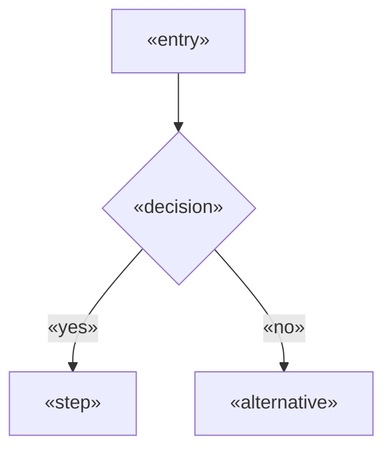
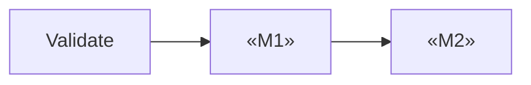

# Template — Execution Plan

---

# Usage

Copy everything below the line into `projects/<slug>/research/10-execution.md` and fill it.

This is a **working document**. It feeds three deliverables, including the only one the
manifest marks `critical`:

| Deliverable | Fed by |
| --- | --- |
| `08-UX-Flows.md` | §3, §4, §5, §6 |
| `09-Roadmap.md` | §7, §8, §9, §11 |
| `12-Build-Handoff.md` | §2, §8, §10, §12, §13 — **critical** |

| Marker | Meaning |
| --- | --- |
| `«placeholder»` | Replace with real content |
| `<!-- guidance -->` | Instructions for you. Remove before completing |
| `[tag]` | Evidence tag per `engine/evidence-policy.md` |

**The standard for this document** is that a builder with no access to the run could start
work today. Not "could understand the plan" — could start.

**On durations:** this framework does not know the team. Any duration is an operator input or
an `[assumption: needs validation]`, never a derived figure. Sequence, relative size and
dependency are what this module can establish honestly.

---
---

# Execution Plan — «Project Name»

| | |
| --- | --- |
| Module | 10-execution |
| Date | «ISO date» |
| Requirements | «n» MUST, from `08-product` |
| Problem evidence standing | **verified / assumed** |
| Milestone Zero required | **yes / no** |
| Assumed team | «size and composition, or "not supplied — durations omitted"» |
| Status | draft / reviewed / gated |

---

## 1. The Plan, in One Paragraph

<!-- Write last. What gets built first, in what order, and what governs that order. -->

«One paragraph.»

---

## 2. Inherited Inputs

| | |
| --- | --- |
| First shippable slice | «from `08-product` §11» |
| Critical path | «from `08-product` §11» |
| One-way doors | «from `09-technology` §13» |
| Milestone Zero | «required / not required — from `07-strategy`» |
| Core job, numbered | «from `03-user`, via `08-product` §5» |
| Persona constraints | «interruption, device, connectivity, time pressure — from `03-user`» |
| Blocked items | «open questions from `08-product` and `09-technology`» |

---

## 3. Design Principles

<!-- Move 1. Three to five, each derived from a research finding. Not UX platitudes.
     "The user is interrupted constantly" → "every action must survive being abandoned
     halfway" is useful. "Keep it simple" is not. -->

| # | Principle | Derived from |
| --- | --- | --- |
| 1 | «principle» | «finding, with module» |

---

## 4. Critical Paths

<!-- The two or three flows that carry the product. Each maps a MUST requirement set
     end to end — trigger to outcome, including what can fail at each step. -->

### CP1 — «flow name»

| | |
| --- | --- |
| Serves | J«n», R«n», R«n» |
| Persona | «who» |
| Frequency | «how often they do this» |
| Success means | «what "done" is to them» |

| Step | User sees | User does | System does | Can fail |
| --- | --- | --- | --- | --- |
| 1 | «screen / state» | «action» | «response» | «how» |

| | |
| --- | --- |
| Step count | «n» |
| Requirements covered | R«n», R«n» |

**Failure and recovery**

| Failure | User sees | Recovery | Work preserved |
| --- | --- | --- | --- |
| «what» | «message» | «what they do» | «yes / no» |

<!-- Repeat per critical path. The failure table is not optional — module 08 specified
     these edge cases, and this is where they become something a user experiences. -->

---

## 5. Time to First Value

<!-- The number that predicts adoption. Count the steps; state the minutes. -->

| | |
| --- | --- |
| "First value" is | «the specific moment the user gets something they wanted» |
| Steps to reach it | «n» |
| Target | «n minutes» |
| Longest unavoidable step | «what, and why it cannot be removed» |
| Migration required first | «yes — where it sits in the flow / no» |

---

## 6. Screens and States

<!-- Every screen, with its non-populated states. A screen specified only in its
     populated state ships broken. Sources: `08-product` §8 edge cases. -->

| Screen | Purpose | Empty | Loading | Error | Permission |
| --- | --- | --- | --- | --- | --- |
| «name» | «why it exists» | «what shows, what action is offered» | «behavior» | «message + recovery» | «what is shown» |

**First-run state:** «what a brand new user sees before any data exists, and how they are
guided out of it»

**Accessibility target:** «standard» — **verified how:** «method»

**Context constraints from `03-user`:** «gloves, bright light, one-handed, interrupted,
shared device — as concrete requirements»

---

## 7. Milestones

<!-- Move 2 and 3. Every milestone must be a VERTICAL slice: it crosses every layer and
     ends with something a person can do. "The data layer is complete" is not a milestone.

     Milestone Zero comes first when the sharpest problem is assumed. -->

**Sequencing principle:** «one sentence — de-risk earliest / value earliest / dependency
order / learn earliest. Pick one; they conflict.»

**Why this and not «alternative»:** «one sentence»

### M0 — Validate Before Building

<!-- Mandatory when the sharpest problem is assumed. From `04-problem`'s validation plan,
     carried through `07-strategy`. If the problem is verified, state that and remove
     this milestone. -->

| | |
| --- | --- |
| Purpose | «the belief this tests» |
| Method | «from `04-problem`» |
| Sample | «n, and who» |
| Proceed if | «the specific result that justifies building» |
| Stop and rethink if | «the specific result that does not» |

### M«n» — «name»

| | |
| --- | --- |
| Delivers | «what a user can do at the end of this that they could not before» |
| Requirements | R«n», R«n» |
| Depends on | M«n» / none |
| Relative size | S / M / L |
| Duration | «operator input, or omitted» `[tag]` |

**Demo test:** «what you can show a real user doing when this is done. If the answer
describes a layer rather than an action, this is not a milestone.»

**Definition of done**

- [ ] «acceptance criteria from `08-product` §7, listed explicitly»
- [ ] «the non-functional bar — tests passing, deployed where, reviewed by whom»

**Explicitly not done at this point:** «what a reader might assume is finished and is not»

**What this milestone teaches:** «the question it answers about the product»

<!-- Repeat per milestone. -->

---

## 8. Sequence and Critical Path

| | |
| --- | --- |
| Longest chain | «M0 → M1 → M2 → launch» |
| Independently shippable | «which milestones can ship alone» |
| Can run in parallel | «what, and what it would require» |
| One-way doors, and when they are committed | «decision, milestone» |

**Why the one-way doors sit where they do:** «early enough to be right, late enough to be
informed — state the reasoning»

---

## 9. Decision Points

<!-- Moments where the plan is re-evaluated against real data rather than executed on
     faith. -->

| After | Question | Data needed | Possible outcomes |
| --- | --- | --- | --- |
| M0 | Is the problem real? | «test result» | proceed / pivot / stop |
| M«n» | «question» | «metric» | continue / rework |

---

## 10. Verification Strategy

<!-- Move 5. What gets tested, at what level, and how a failure is recognized.
     Every MUST requirement needs at least one verification. -->

| Level | Covers | Owner |
| --- | --- | --- |
| Unit | «business rules, constraints from `09-technology` §3» | build |
| Integration | «the interface contract from `09-technology` §6» | build |
| End to end | «the critical paths in §4» | build |
| Manual | «what cannot be automated, and why» | «who» |

**Coverage table**

| Requirement | Verified by | Level |
| --- | --- | --- |
| R1 | «test or check» | «level» |

**Unverified requirements:** «none, or list them with the reason»

**Edge cases verified:** «confirm the five categories per requirement from `08-product` §8
are covered, or name the gaps»

**What is deliberately not tested, and why:** «an honest position beats an implied claim of
full coverage»

---

## 11. Deferred Scope

<!-- Carried from `08-product` §10. Triggers, not dates — dates on unvalidated scope are
     fiction. -->

| Capability | Serves | Revisit when |
| --- | --- | --- |
| «capability» | P«n» | «trigger» |

---

## 12. Blocked Work

<!-- Anything that cannot start until a question is answered. This is where unresolved
     assumptions go — NOT into the build instructions, where someone will guess.
     If nothing is blocked, write "None". -->

| # | Blocked | Waiting on | Owner | Needed by |
| --- | --- | --- | --- | --- |
| B1 | «what cannot start» | «question or decision» | «named person / operator» | M«n» |

**Can M1 proceed with everything above unresolved?** «yes / no — if no, this is a blocker
for the whole plan and must be surfaced»

---

## 13. Non-Negotiables

<!-- Rules that hold regardless of implementation choices. Carried from `09-technology`'s
     security model and `02-market`'s regulatory constraints. A violation is a defect,
     not a trade-off. -->

| # | Rule | Source | Consequence if broken |
| --- | --- | --- | --- |
| 1 | «rule» | «module / regime» | «impact» |

---

## 14. Estimate Basis

<!-- Only completed when the operator has supplied team facts. Otherwise state that
     plainly and give relative sizes only. -->

| | |
| --- | --- |
| Assumed team | «size, composition — or "not supplied"» |
| Basis for durations | «comparable work / operator estimate / not estimated» |
| Biggest estimation risk | «what is most likely to take longer, and why» |

> An estimate with no stated team is not an estimate. Where team facts are absent, this
> section says so and §7 carries relative sizes only.

---

## 15. Open Questions

| # | Question | Blocks | Who answers |
| --- | --- | --- | --- |
| Q1 | «question» | «milestone» | operator / design / user research |

---

## 16. Handoff Readiness

<!-- The cold-start check, run explicitly before the gate. -->

| Check | Status |
| --- | --- |
| First task nameable in one sentence | «yes / no» |
| Every reference resolvable from the deliverable set | «yes / no» |
| No unresolved assumption in a build-blocking position | «yes / no» |
| Definition of done present for M1 | «yes / no» |
| Instrumentation for M1 identified | «yes / no — from `12-metrics`» |
| A builder with no context could start today | «yes / no» |

**If any answer is no:** «what is missing, and whether it is a gap here or a regress»

---

## 17. Handoff

| Consumer | What it takes from here |
| --- | --- |
| `12-metrics` | Milestones and decision points — what must be measurable and by when |
| `13-operations` | Launch milestone, verification strategy, non-negotiables |
| `11-growth` | Launch timing and the activation moment in §5 |
| `08-UX-Flows.md` | §3–§6 |
| `09-Roadmap.md` | §7, §8, §9, §11 |
| `12-Build-Handoff.md` | §2, §8, §10, §12, §13 |

---

<!-- ACCEPTANCE — remove before completing
- [ ] Design principles derived from findings, not generic
- [ ] Critical paths mapped end to end, with a failure and recovery table each
- [ ] Time to first value stated in steps and minutes
- [ ] Every screen has empty, loading, error and permission states
- [ ] Every milestone is a vertical slice and passes the demo test
- [ ] Milestone Zero present when the problem is assumed
- [ ] Definition of done per milestone, including what is NOT done
- [ ] One-way doors placed deliberately in the sequence, with reasoning
- [ ] Every MUST requirement has a verification
- [ ] What is deliberately not tested is stated
- [ ] Deferred scope carries triggers, not dates
- [ ] Blocked work listed with named owners, or "None"
- [ ] No duration stated without an assumed team
- [ ] §16 cold-start check complete, with every answer yes
- [ ] Every «placeholder» replaced and every guidance comment removed
-->

---

> **Template Principle**
>
> Every other module's output is read and then acted on.
>
> This one is read *while* acting. It is written for someone
> with a keyboard open and no one to ask.
